# Group Stratified Shuffle Split (Binary)

This README describes the cross-validator `GroupStratifiedShuffleSplitBinary` which, as the name might suggest, generates stratified and grouped cross validation folds. The process of generating such a cross-validator is a bit more involved than the standard CV types available e.g. in `sklearn`, a point I've laboured to get across in the section _Group Stratified Shuffle Split_. Anyway, I hope this cross-validator is useful, and the example clear to you.

Before jumping into the specifics of this cross-validator, perhaps it's wise to remind ourselves why we use cross-validation when training our models, and to discuss which types of cross-validators are open to us. 

## Life without cross-validation

When presented with a dataset containing various features along with some target variable, typically our goal is not simply to fit a model leading to the lowest loss function on the dataset. Rather, we are interested in finding a model which will perform well on unseen data. For example, after training a model on some historical stock price data, we would most likely judge that model's success on how well it predicts tomorrow's stock prices, rather than the _R_2 coefficient it acheived on historical data.

To this end, we typically segregate our data into train and test splits, where the former is used to train our model, and the latter is used to evaluate its performance. That is, the test split is data excluded from the training process for the explicit purpose of validating our model's generalizability. So far, so good. 

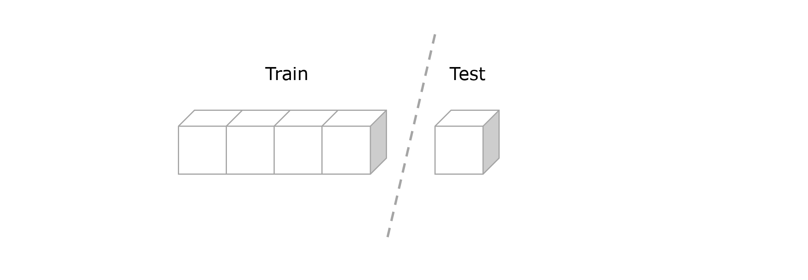

However, within the three words *train our model* lies a great deal of detail, and so as the [saying goes](https://en.wikipedia.org/wiki/The_devil_is_in_the_detail), also lies, the devil. For, even if we restrict ourselves to a single algorithm, we still have a (usually infinite) number of models to choose from. Take for example a [Random Forest](https://scikit-learn.org/stable/modules/generated/sklearn.ensemble.RandomForestClassifier.html), we could train a given forest with a specified number of trees, class weight, maximum tree depth etc. on our training data, and then ascertain it's performance by evaluating it on the test data. Now however, say we have a feeling that altering some properties of our random forest (e.g. increasing the number of trees), will improve the performance of our model. We can again train this new forest on our training set, and decide to keep it or stick with our previous random forest depending on how well each performed on our test data.

But why stop there? We could repeat the same process, performing a search over an entire hyper parameter space, by choosing points (e.g. on a grid or by random sampling) in that space, training a forest with those hyperparameters, and evaluating its performance on held-out test data. After searching over what we deem to be a sufficient number of hyperparameters, we'll just choose the model which scored best on the test data.

The problem however, is that in optimizing our model in such a manner, we have gone against our entire premise of splitting data into training and test; by holding out a portion of the data we were trying to ascertain how well a model would perform on unseen data, *but by refining hyperparameters on the test score we have unwittingly optimized a model which performs very well on the data we were given, and have no idea how it will generalize*. Essentially we have re-combined the train and test splits.

## Cross-validation saves the day

Fortunately, cross-validation provides us with a solution to this problem. Though, as we will see, there are many cross-validators available to us as data scientists, they all work under the same basic premise; by (repeatedly) segregating the training data into a portion for testing and a portion for evaluating a model, we're able to compare various models, whilst reserving the test data for a final evaluation of the best performing model.

To make this concrete, we can consider 4-fold cross-validation, as shown diagramatically below

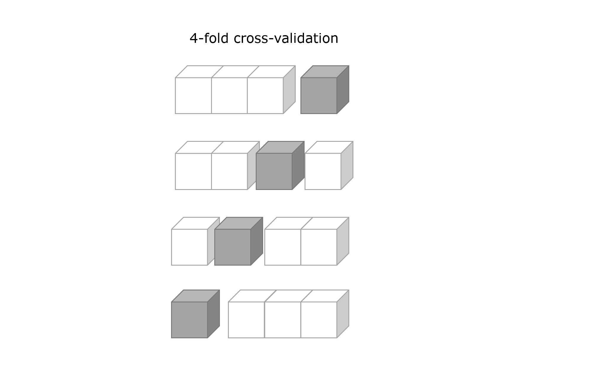

Here, we split our data into 4-folds, train a model on three of the folds (white cubes), and evaluate it on the fourth (grey cubes). We carry out this procedure four times, and can estimate the model's test error by evaluating the average test error of these four trials. (As a technical aside, it is interesting to note that there exists no unbiased estimator of the variance of such a k-fold cross-validation [(Bengio and Grandvalet, 2004)](www.jmlr.org/papers/volume5/grandvalet04a/grandvalet04a.pdf)).

Using this procedure, we can happily perform our exploration of hyperparameter space, cross-validating at each point, computing a test error estimate from this, and selecting our best performing model. We can then evaluate this model on the held-out test data to give us an estimate of how well it will perform in the real world. 

## Cross-validators

There are a number of cross validators available to us as data scientists, here we'll review some of those provided by the `sklearn` library, loosely based on the summary shown here [here](https://scikit-learn.org/stable/auto_examples/model_selection/plot_cv_indices.html#sphx-glr-auto-examples-model-selection-plot-cv-indices-py).

For this example, we'll consider a generated dataset of 30 students, each student has a name (which we randomly sample from the dataset provided [here](https://github.com/hadley/data-baby-names/blob/master/baby-names.csv)), a year of graduation, and a boolean indicator showing whether they went on to study at university or not. The first 5 rows of the dataframe are as follows:

| name     | uni (y/n)   |   year |
|:---------|:------------|-------:|
| Billie   | y           |   2014 |
| Carson   | y           |   2014 |
| Evaline  | n           |   2014 |
| Viviana  | n           |   2014 |
| Penelope | n           |   2014 |

We can also plot our dataset:

  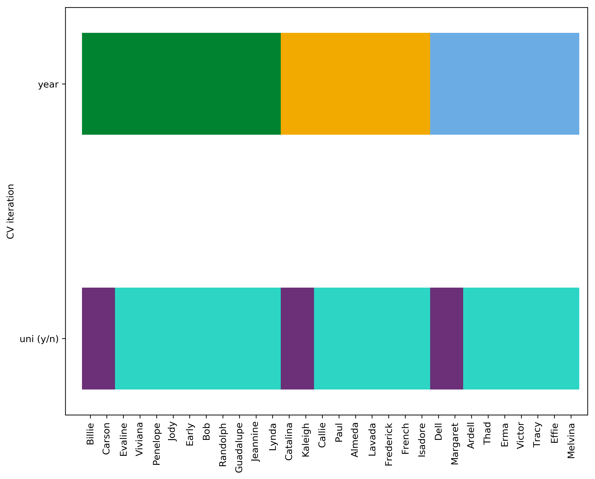

Where the graduation year (2014 (green), 2015 (yellow), 2016 cyan) for each student and whether they went on to attend uni (yes (purple), no (turquoise)) is noted.

### k-fold CV

Now let's see how different cross-validators partition this dataset. First of all we'll consider the k-fold cross validation described above, just as in that description, we'll use 4-folds.

  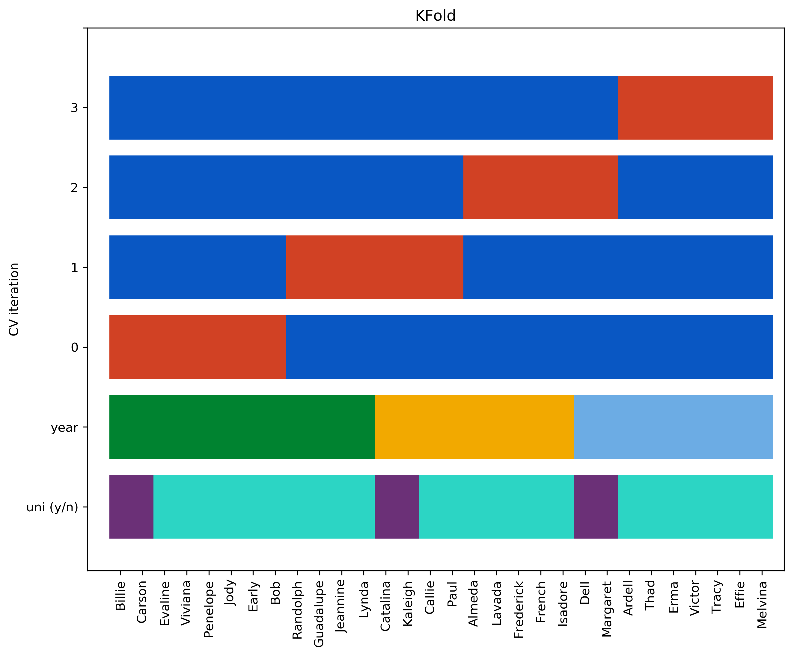

As we can see, at each 1/k cross-validation iteration, a 1/k (i.e. a quarter in this example) of the data is held out for testing (shown in red) while the rest is used for training (shown in blue).

The `year` and `uni (y/n)` are ignored in determining the train-test splits of the k-fold cross-validation, but we might imagine a situation where we'd like to take them into account. Perhaps we're training a model to predict which students will go on to study at university. As we can see, our dataset is very imbalanced with regards to this target variable. We'd like our training-test splits to reflect this. Luckily, `StratifiedKFold` does just that.

### Stratified k-fold

  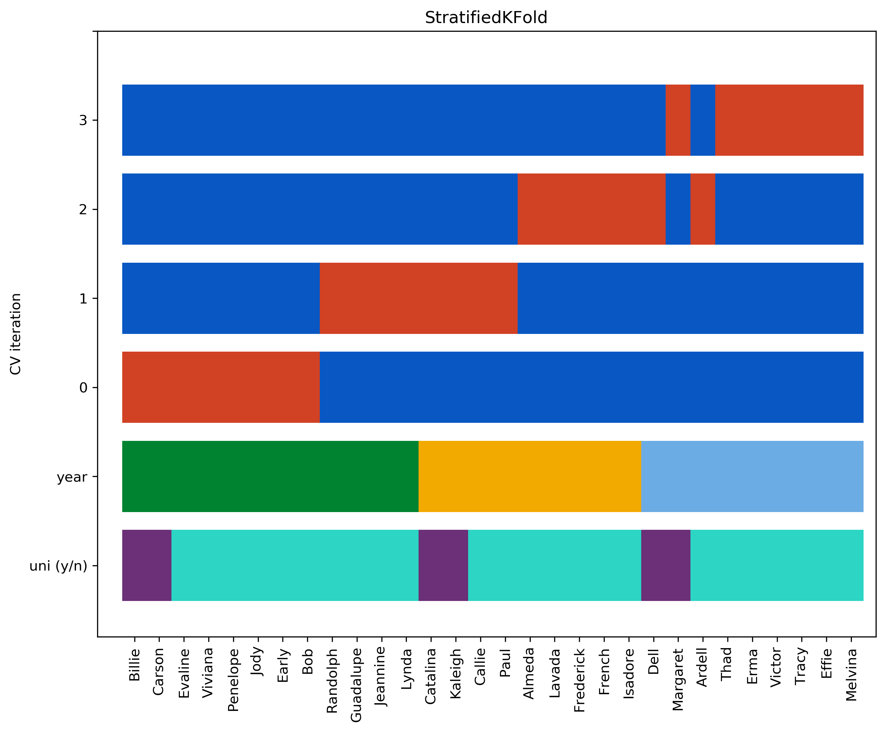

We can see that the train-test splits reflect the stratification of the dataset with regards to the target variable `uni (y/n)` (though only approximately in this case as we have 6 `uni (y/n)=y` cases to split between 4 folds).

### Grouped k-fold

We might also want a k-fold stratifier that takes account of how our data is grouped, `GroupKFold` keeps groups separated from eachother in the train-test splits. In this case the group is graduation year, and we only have three such years, so only three splits are possible:

  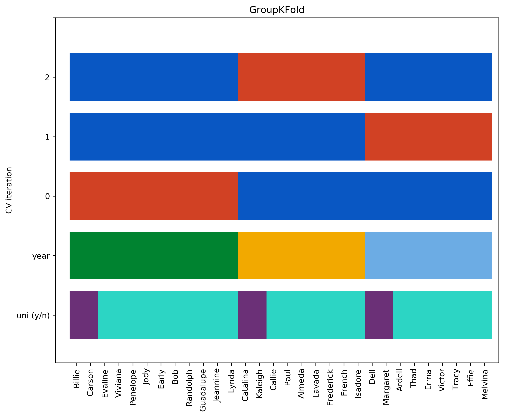

## Beyond k-fold cross-validators

The previous classifiers use some form of k-fold methodology, where the dataset is split into k chunks, and each data point (students in our example) appears in the testing split once, and the training split (k-1) times. These folds and splits are uniquely defined from the moment we choose our classifier. However, to improve generalization we may want to randomly sample train and test groups from our data at each validation iteration. This will have the disadvantage, for example, that data points may pop-up multiple times in the test split. The flip side is that it will give us much more freedom in our cross-validation, e.g. we might choose a 9:1 train:test split to be run for 5 iterations, whereas running this ratio for k-fold validation would require 10 iterations, and therefore be twice as computationally expensive.

These types of cross-validators are denoted by the word "Shuffle" in `sklearn`, as they randomly shuffle the dataset before each cross-validations iteration. Let's look at how they apply to our example data.

### Shuffle Split

As described above, `ShuffleSplit` allows us to specify a test size (here it's 0.25, as before), and a number of iterations to perform (we choose 4)

  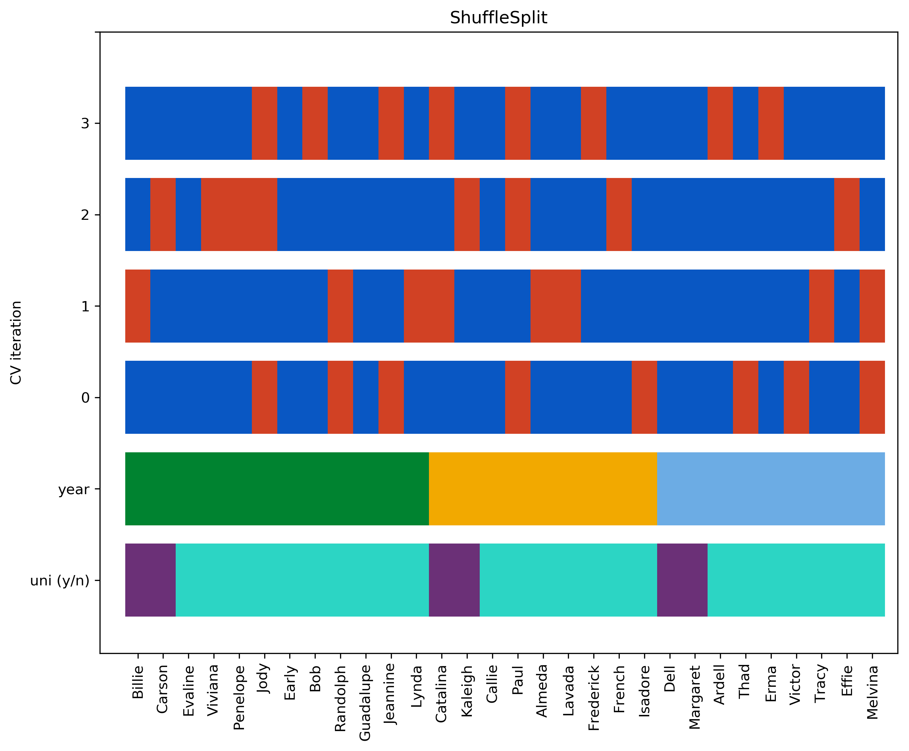

Note that due to the randomized nature, some students appear in the test split multiple times.

### Stratified Shuffle Split

`StratifiedShuffleSplit` takes account of the stratification of the entire dataset with regards to some target variable (which here is `uni (y/n)` again)

  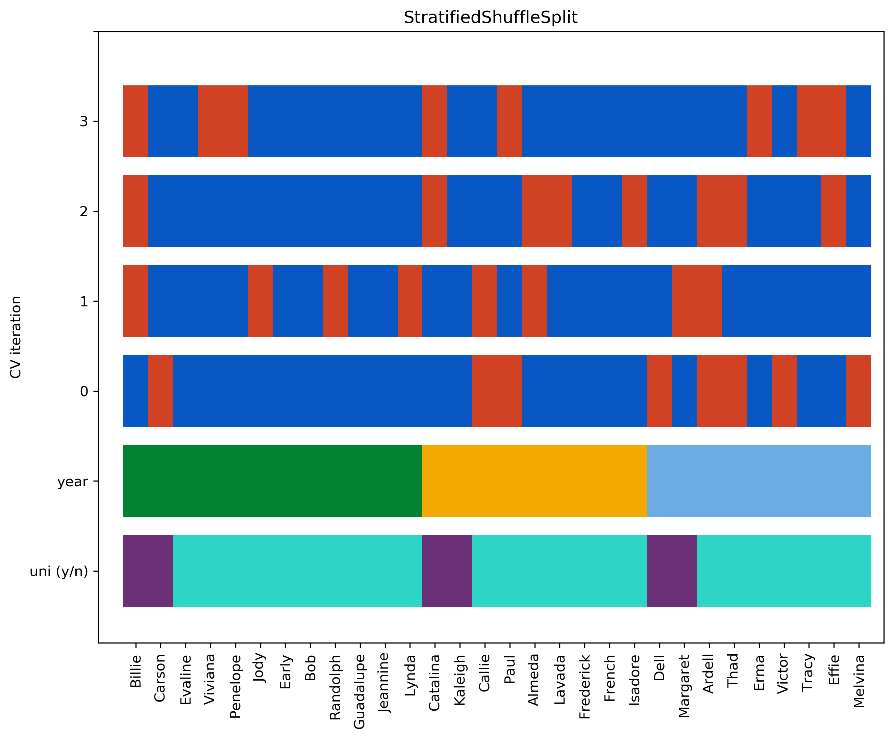

### Group Shuffle Split

`GroupShuffleSplit` ignores the stratification of the dataset with regards to target variable, but ensures that different groups are seperated in training and testing (our groups here are the graduation years)

  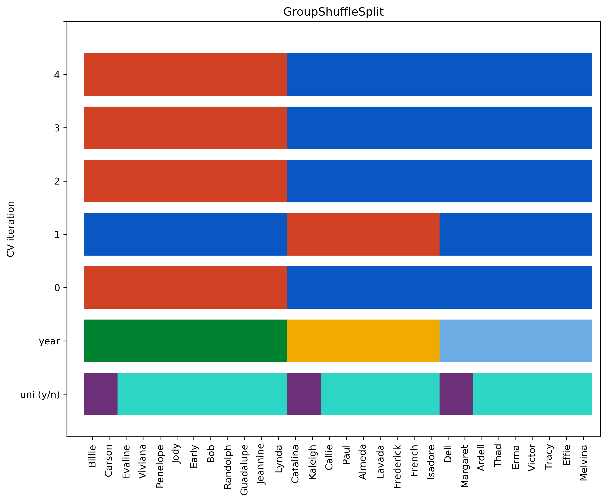

Ok, so for 3 groups (school years in our case) the result is rather trivial, but we can see how this cross validator keeps groups seperated in train and test, doing this randomly with each CV iteration.

## Group Stratified Shuffle Split

Following the last two examples, we might expect the next cross-validator to follow would be one which captured the essence of its two predecesors. That is, a cross-validator which keeps groups seperated between train and test splits, as well as ensuring that the proportion of 'positive' or 'negative' samples (i.e. based on a defined target variable) in the train and test split (ensuring this is the case for either the train or test is clearly sufficient) are representative of the dataset as a whole (i.e. stratified).

### A (too) simple example

For our previous example, each group (school year) had the same proportion of students going on to study at university, therefore the `GroupStratifiedShuffleSplit` cross-validator performs similarly to `GroupShuffleSplit`:

  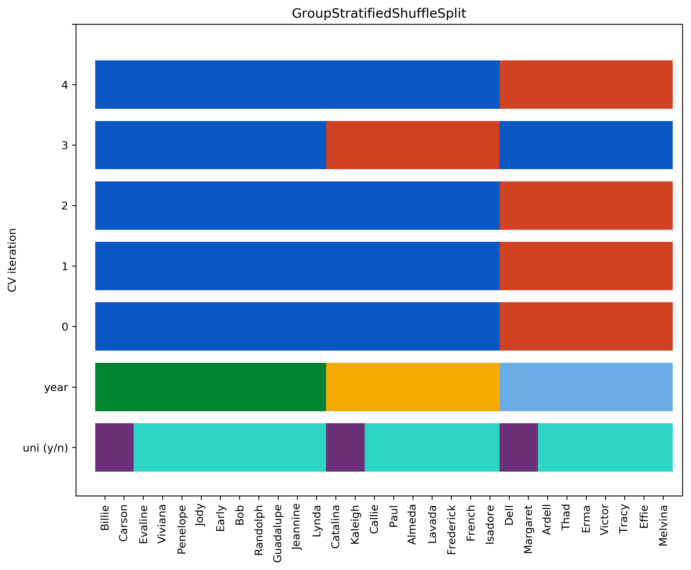

### The Difficulty in splitting by Group and keeping things Stratified

In a more realistic scenario, each group will typically contain a different proportion of 'positive' and 'negative' (as defined by the target variable) samples. We'd like to specify a train:test ratio (e.g. 0.8:0.2), then let our cross-validator go ahead and sort the data into train and test portions, with each group being in either of (but not both) the train or test split, and the train and test split being representative of the entire data set with respect to the target variable (i.e. stratified). We can then state our requirements as follows; our `GroupStratifiedShuffleSplit` cross validator should adhere to the following conditions:

1. Each group occurs in either the test or train splits. The number of samples in train-test is specified as a ratio by the user, though we allow our cross validator to reach this ratio approximately, as the size of groups may make reaching an exact train-test split impossible. This is the `Group` part.

2. Both the train and test splits contain a proportion of 'positive' and 'negative' (as defined by the target variable) samples which is representative of the entire data set. We let our cross-validator be approximately representative as condition 1. already constrains the CV quite strongly. This is the `Stratified` part.

3. The train and test splits should be randomized on each iteration, otherwise we make redundant all the statistical merits of running multiple CV iterations. This is the `Shuffle` part.

If we simply let our cross-validator randomly choose a number of groups for the train and test splits which achieve the closest value possible of the desired train-test split (i.e. conditions 1 and 3 are satisfied), we have no guarantee that the train and test data will be correctly stratified (i.e. condition 2 is not satisfied). Moreover, if we simply constrain the validator to find the best train-test split under the constraint that groups cannot be split between train and test (i.e. conditions 1 and 2 are satisfied), we have a unique solution and get the same split each time (i.e. condition 3 is not satisfied).

### How we select samples for the training set

Here we'll go into detail about how we circumvent some of the problems raised in the previous section. We'll talk about forming the training set, the test set will then simply be formed of all the entries not used in the training set (we could equivalently build the test set in this manner, then form a training set from all entries not selected for the training set).

Firstly, we calculate some aggregates for all groups in our data, namely; the number of entries (_N_entries), the number of those entries with target variable `= True` (_N_target), and the proportion of target variable `= True` within the group (_N_target/_N_entries). This gives us a table which looks something like this:

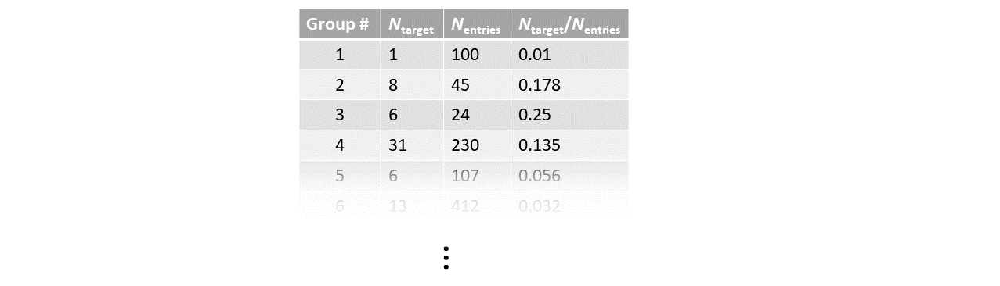

Next we randomly select (without replacement) one group and add it (i.e. all entries belonging to that group) to the training set:

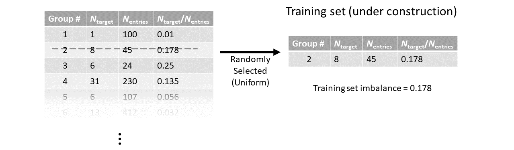

The first thing to check now that we've begun contructing our training set is the ratio of train to test splits. The user specifies a ratio _R_tt &#8797; _N_test/_N_train and we want to get as close to that as possible, so we check that the current number of entries in our (under construction) training set, let's call it _N_train,1 (it's simply = 45 in our example here), is sufficient. That is, if: 

&space;R_{tt}" title="\frac{N-N_{train,1}}{N_{train,1}} > R_{tt}" />

then we must add further groups to our training set. Let's safely assume that for our ficticious dataset, after selecting a single group, this is the case. Then we need to add some more entries, i.e. another group, to our training set. But which group should we choose? 

The stratified nature of the cross-validator means that we are constrained to have a class imbalance in our training set (approximately) equal to the class imbalance of the total data set. Let's call the total class imbalance, _I_(_t__N_), and the current (under construction) training set imbalance _I_(_t_1). 

Though this notation seems a little cumbersome, it's trying to get across that the imbalance is a function acting on some set of entries in our dataset. This function outputs the class imbalance of that set (a real number between 0 and 1). Additionally, we've denoted the set of entries in our (under construction) training set after the first iteration -- i.e. having only chosen entries from a single group -- by _t_1. Generalizing, _t__i_ is the set of entries in our (under construction) training set after adding entries from _i_ different groups (i.e. the _i_th iteration). Similarly, we denote the set of entries in group _j_ as _g__j_. Hopefully this will make sense as we go on, but to give some concrete values from the example we have here; _I_(_t_1) = 0.178, _I_(_g_1) = 0.01, _I_(_g_3) = 0.25, ...

Now, back to the matter of bulking up our training set. When choosing the next group to add to our training set, we'd clearly like to make the choice such that the next iteration of our training set has an imbalance _I_(_t_2) which is closer to _I_(_t__N_) than _I_(_t_1) was. Simply put, if our training set currently contains too small a proportion of positive training examples, we'd like that the next group we add to our training set have a high proportion of positive training examples, and vice versa. 

Concretely, let's define a value &#916;_1_,_j_ for each group in our dataset as:

If you inspect this value carefully, you'll see it has some properties we'd like for choosing the next group to add. Concretely, if our training set currently contains too small a proportion of positive training examples (i.e. _sgn_(_I_(_t_1)-_I_(_t__N_))<0) then, as we've already said, we'd like to add groups with a large proportion of positive examples (i.e. _I_(_t_1)-_I_(_g__j_) < 0), i.e. groups with a large positive value of &#916;_1_,_j_. You should be able to work out that the converse scenario also leads to desiring groups with large positive &#916;_1_,_j_ for our next addition to the training set. We can transform this &#916;_1_,_j_ into a probability via:

where &#946; is a hyperparameter, or if you like, an inverse temprature. Now we simply calculate this value for all groups not yet selected in our (under construction) training set...

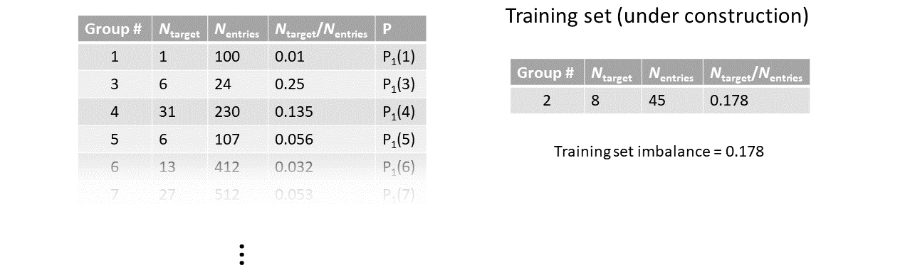

... and then select the next group based on these probablities _P_1.

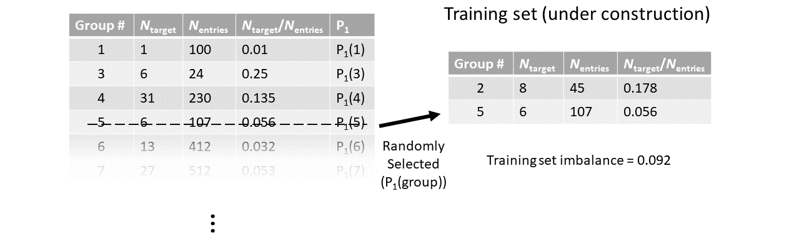

Now we simply go ahead and repeat this process, calculating the current number of entries in our (under construction) training set, _N_train,2, (it's = 152 in our example here),
and ensuring the inequality:

&space;R_{tt}" title="\frac{N-N_{train,2}}{N_{train,2}} > R_{tt}" />

holds, calculate updated probabilities for the remaining groups using the generalized forms of &#916; and _P_:

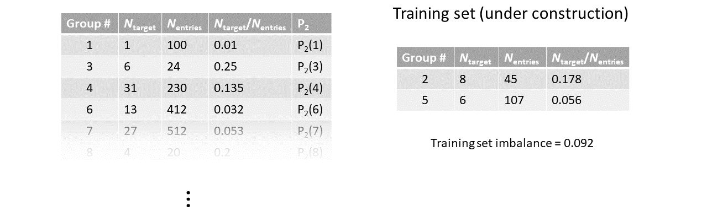

This process continues until we've added _k_ groups to our (under construction) training set s.t. the inequalities:

and

&space;R_{tt}" title="\frac{N-N_{train,k-1}}{N_{train,k-1}} > R_{tt}" />

hold. Our completed training set then contains either _k_ or _k-1_ entries, whichever gives a ratio closer to _R_tt.

### A better example

Let's consider a more complex version of the previous dataset. Namely, we'll generate a dataset with 1000
students who are distributed between 20 different year groups, and this time we'll include some features to train our model on. Our target variable will again be `uni (y/n)`. Let's take a look at the first few rows: 

| name      |   final_year |   height_cm |       iq |   weight_kg | uni (y/n)   |
|:----------|-------------:|------------:|---------:|------------:|:------------|
| Rosemary  |         2010 |     163.075 |  83.6299 |     35.2404 | False       |
| Jackie    |         2008 |     149.774 |  81.2499 |     46.9199 | False       |
| Devon     |         2004 |     176.356 | 143.567  |     68.9267 | False       |
| Wilburn   |         2006 |     128.204 |  85.4863 |     44.182  | False       |
| Anastasia |         2016 |      73.213 | 128.171  |     39.424  | True        |

Let's plot this dataset in the same way we did with our smaller one earlier. There are too many names to be resolved clearly, but we include them just to drive home the idea that each point on the x-axis corresponds to a different entry in our dataset (i.e. a different student in this example).

  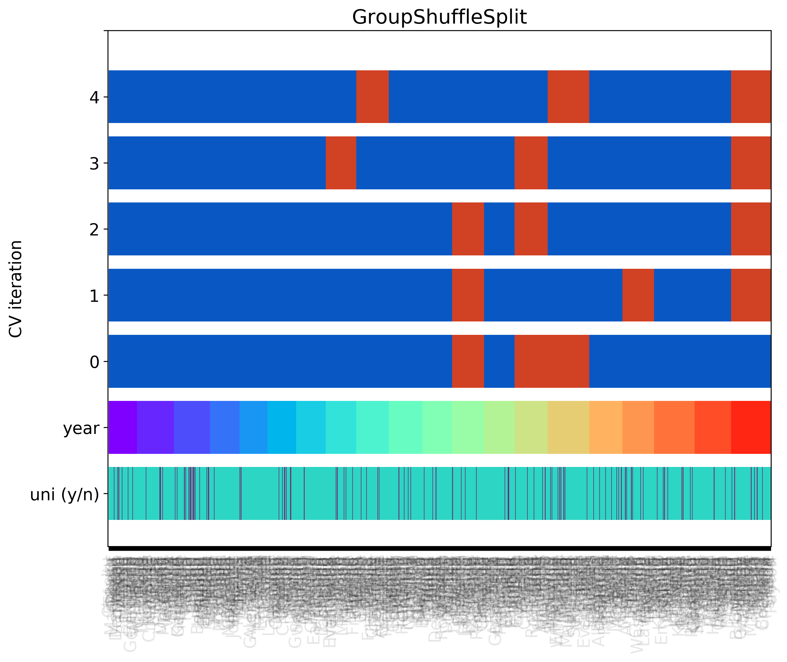

Let's go ahead and train a Random Forest model on this data (where we're attempting to predict whether a given student will go to uni). We'll want to tweak the hyperparameters, and for that we'll need a cross validator. Specifically, we'll perform a random hyper parameter search using `sklearn`'s `RandomizedSearchCV` function, and we'll do this three seperate times, using three seperate cross validators; `StratifiedShuffleSplit`, `GroupShuffleSplit`, and our very own `GroupStratifiedShuffleSplitBinary`.

Let's take a look at the scoring metric (we chose area under the precision recall curve here, which is normally a pretty good choice for imbalanced data) for after each iteration for each CV:

  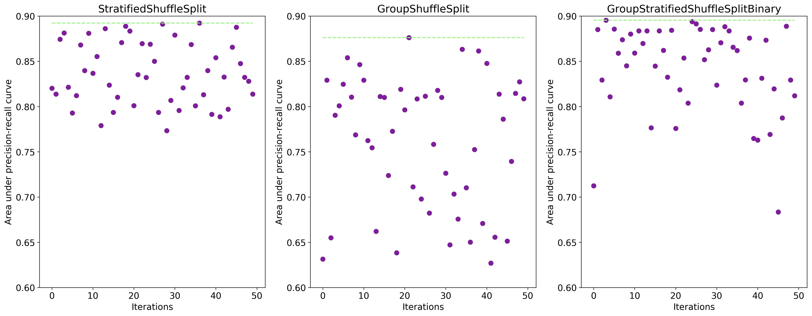

Ok, so following this, we now have three different Random Forest models, each with their own 'optimal' parameters (i.e. the model giving the highest area under the precision recall curve in each of the above three plots). But what we really want to know is how well they perform on unseen data. With this in mind, let's try them out on the next academic year's students. Again, let's show the first few rows:

| name    |   final_year |   height_cm |       iq |   weight_kg | uni (y/n)   |
|:--------|-------------:|------------:|---------:|------------:|:------------|
| Davis   |         2020 |    150.74   |  78.2723 |     44.4224 | False       |
| George  |         2020 |    107.643  | 120.279  |     49.3231 | False       |
| Kerry   |         2020 |     97.338  |  99.4542 |     59.7697 | False       |
| Jean    |         2020 |    123.797  | 121.838  |     59.5049 | False       |
| Lavonne |         2020 |     86.5739 | 120.254  |     60.8119 | True        |

Let's run our three models on our unseen data and see what happens, the confusion matrices will give us a great idea of how each model is performing.

Model optimized using `GroupShuffleSplit`:

 |        | PN | PY | 
 | ---    | --- | --- | 
 | **AN** | 45 | 0 | 
 | **AY** | 2 | 3 |

 Model optimized using StratifiedShuffleSplit:
 
 |        | PN | PY | 
 | ---    | --- | --- | 
 | **AN** | 45 | 0 | 
 | **AY** | 3 | 2 |
 
 Model optimized using GroupStratifiedShuffleSplitBinary:

  |        | PN | PY | 
 | ---    | --- | --- | 
 | **AN** | 45 | 0 | 
 | **AY** | 1 | 4 |

 So we see for this example, the model optimized using a grouped and stratified cross-validator out-performs the other two (if you prefer a single number, the f1 scores were 0.57, 0.75, and 0.89 for models optimized using  `StratifiedShuffleSplit`, `GroupShuffleSplit`, and `GroupStratifiedShuffleSplitBinary`, respectively). If you run this code in the notebook, your randomly generated dataset will be different, and you may not see such a clear distinction between the three.

### Conclusion

I hope this example and my explanations made it a little clearer how this `GroupStratifiedShuffleSplitBinary` cross-validator performs.
 