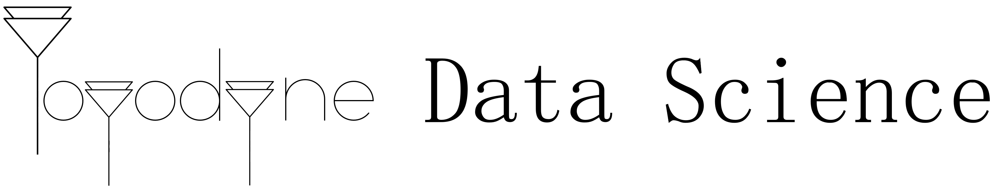
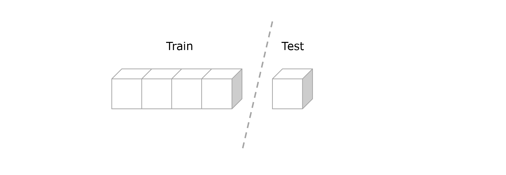
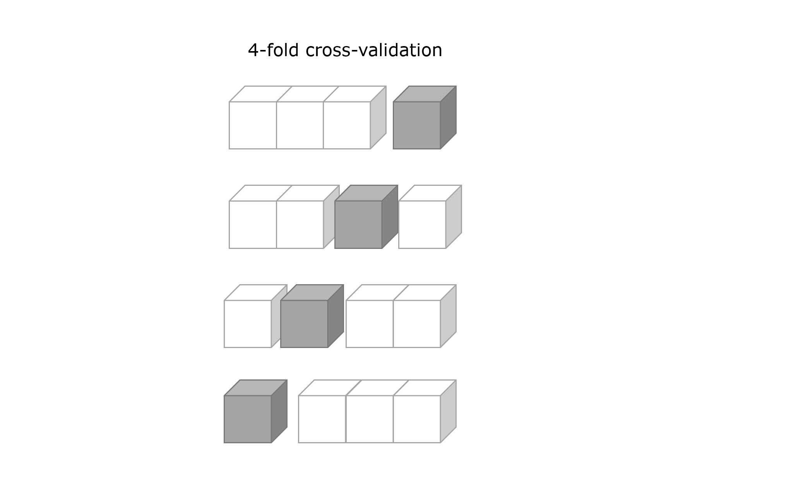
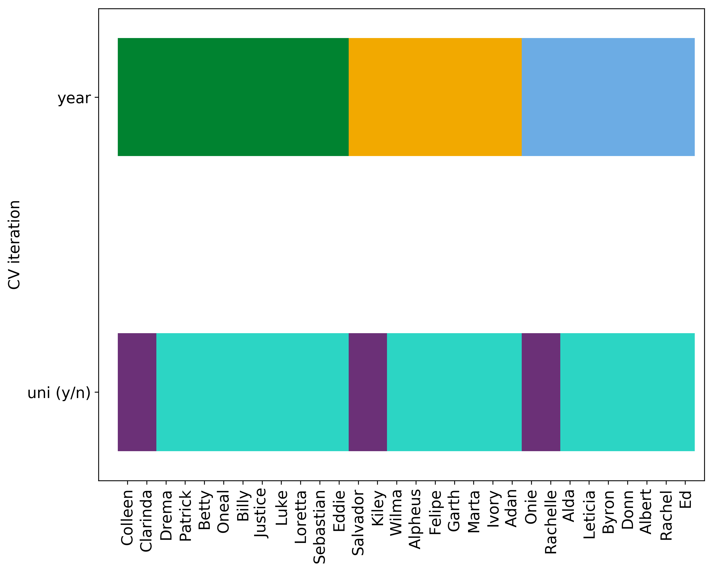
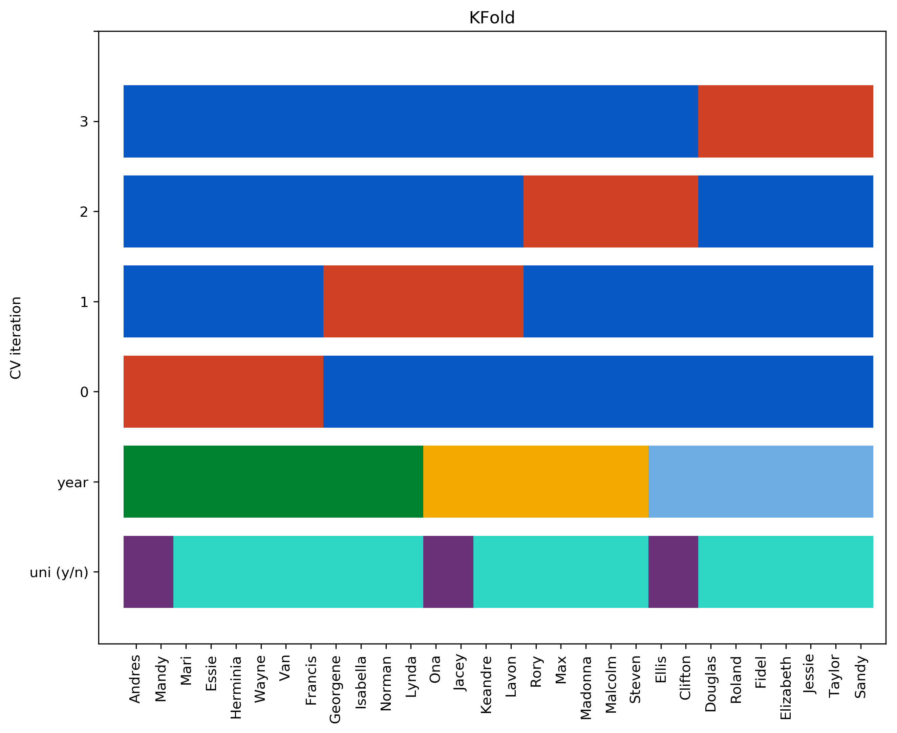
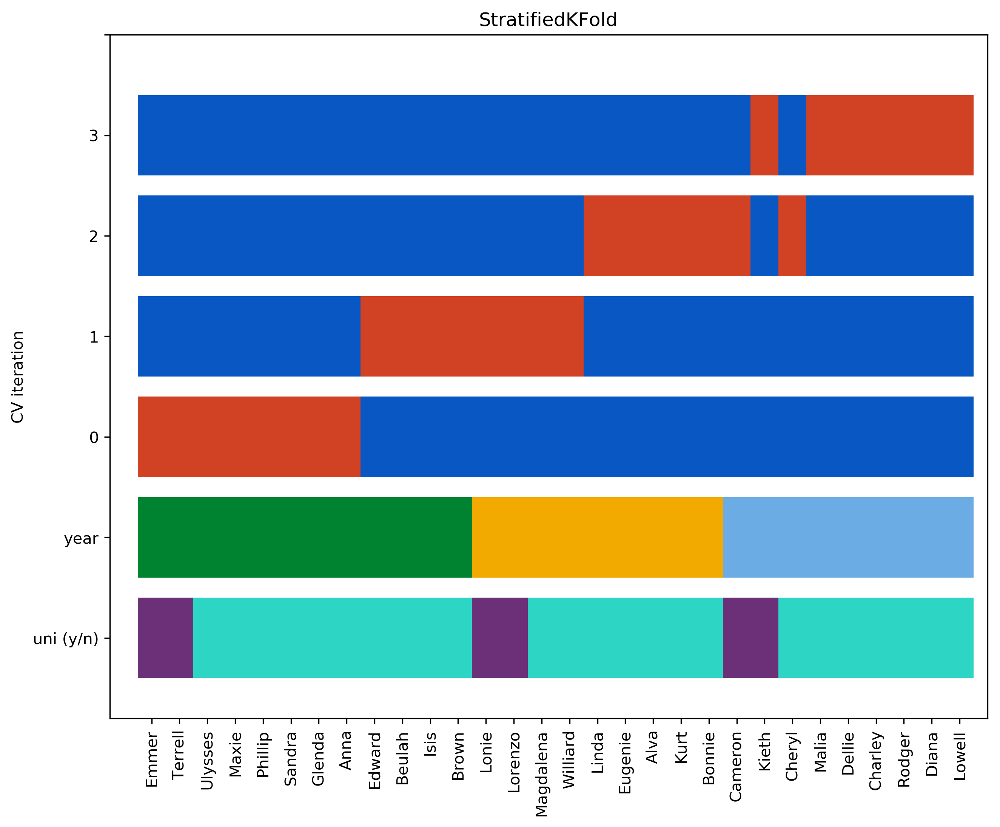
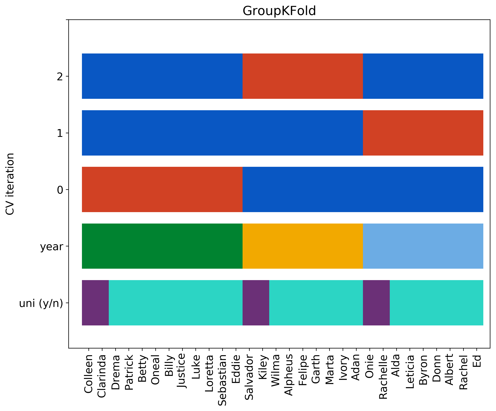

# Group Stratified Shuffle Split (Binary)

Before jumping into the specifics of this cross-validator, perhaps it's wise to remind ourselves why we use cross-validation when training our models, and to discuss which types of cross-validators are open to us. 

## Life without cross-validation

When presented with a dataset containing various features along with some target variable, typically our goal is not simply to fit a model leading to the lowest loss function on the dataset. Rather, we are interested in finding a model which will perform well on unseen data. For example, after training a model on some historical stock price data, we would most likely judge that model's success on how well it predicts tomorrow's stock prices, rather than the $R^2$ coefficient it acheived on historical data.

To this end, we typically segregate our data into train and test splits, where the former is used to train our model, and the latter is used to evaluate its performance. That is, the test split is data excluded from the training process for the explicit purpose of validating our model's generalizability. So far, so good. 

However, within the three words *train our model* lies a great deal of detail, and so as the [saying goes](https://en.wikipedia.org/wiki/The_devil_is_in_the_detail), also lies, the devil. For, even if we restrict ourselves to a single algorithm, we still have a number (usually infinite) number of models to choose from. Take for example a [Random Forest](https://scikit-learn.org/stable/modules/generated/sklearn.ensemble.RandomForestClassifier.html), we could train a given forest with a specified number of trees, class weight, maximum tree depth etc. on our training data, and then ascertain it's performance by evaluating it on the test data. Now however, say we have a feeling that altering some properties of our random forest (e.g. increasing the number of trees), will improve the performance of our model. We can again train this new forest on our training set, and decide to keep it or stick with our previous random forest depending on how well each performed on our test data.

But why stop there? We could repeat the same process, performing a search over an entire hyper parameter space, by choosing points (e.g. on a grid or by random sampling) in that space, training a forest with those hyperparameters, and evaluating its performance on held-out test data. After searching over what we deem to be a sufficient number of hyperparameters, we'll just choose the model which scored best on the test data.

The problem however, is that in optimizing our model in such a manner, we have gone against our entire premise of splitting data into training and test; by holding out a portion of the data we were trying to ascertain how well a model would perform on unseen data, *but by refining hyperparameters on the test score we have unwittingly optimized a model which performs very well on the data we were given, and have no idea how it will generalize*. Essentially we have re-combined the train and test splits.

## Cross-validation saves the day

Fortunately, cross-validation provides us with a solution to this problem. Though, as we will see, there are many cross-validators available to us as data scientists, they all work under the same basic premise; by (repeatedly) segregating the training data into a portion for testing and a portion for evaluating a model, we're able to compare various models, whilst reserving the test data for a final evaluation of the best performing model.

To make this concrete, we canconsider 4-fold cross-validation, as shown diagramatically below

Here, we split our data into 4-folds, train a model on three of the folds (white cubes), and evaluate it on the fourth (grey cubes). We carry out this procedure four times, and can estimate the model's test error by evaluating the average test error of these four trials. (As a technical aside, it is interesting to note that there exists no unbiased estimator of the variance of such a k-fold cross-validation [(Bengio and Grandvalet, 2004)](www.jmlr.org/papers/volume5/grandvalet04a/grandvalet04a.pdf)).

Using this procedure, we can happily perform our exploration of hyperparameter space, cross-validating at each point, computing a test error estimate from this, and selecting our best performing model. We can then evaluate this model on the held-out test data to give us an estimate of how well it will perform in the real world. 

## Cross-validators

There are a number of cross validators available to us as data scientists, here I'll review some of those provided by the `sklearn` library, loosely based on the summary shown here [here](https://scikit-learn.org/stable/auto_examples/model_selection/plot_cv_indices.html#sphx-glr-auto-examples-model-selection-plot-cv-indices-py).

For this example, we'll consider a generated dataset of 20 students, each student has a name, a year of graduation, and a boolean indicator showing whether they went on to study at university or not. The first 5 rows of the dataframe are as follows:

| name    | uni (y/n)   |   year |
|:--------|:------------|-------:|
| Emmer   | y           |   2014 |
| Terrell | y           |   2014 |
| Ulysses | n           |   2014 |
| Maxie   | n           |   2014 |
| Phillip | n           |   2014 |

We can also plot our dataset:

  

Where the graduation year (2014, 2015, 2016) for each student and whether they went on to attend uni (yes, no) is noted.

### k-fold CV

Now let's see how different cross-validators partition this dataset. First of all we'll consider the k-fold cross validation described above, just as in that description, we'll use 4-folds.

  

As we can see, at each 1/k cross-validation iteration, a 1/k (i.e. a quarter in this example) of the data is held out for testing (shown in red) while the rest is used for training (shown in blue).

The `year` and `uni (y/n)` are ignored in determining the train-test splits of the k-fold cross-validation, but we might imagine a situation where we'd like to take them into account. Perhaps we're training a model to predict which students will go on to study at university. As we can see, our dataset is very imbalanced with regards to this target variable. We'd like our training-test splits to reflect this. Luckily, `StratifiedKFold` does just that.

### Stratified k-fold

  

We can see that the train-test splits reflect the stratification of the dataset with regards to the target variable `uni (y/n)` (though only approximately in this case as we have 6 `uni (y/n)=y` cases to split between 4 folds).

### Grouped k-fold

We might also want a k-fold stratifier that takes account of how our data is grouped, `GroupKFold` keeps groups separated from eachother in the train-test splits. In this case the group is graduation year, and we only have three such years, so only three splits are possible:

  

